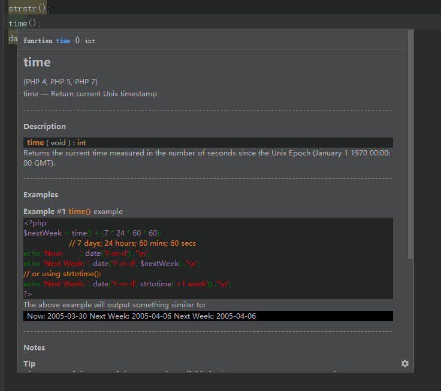

### 介绍

在代码上快速查看php基本函数的中文文档和使用示例, 默认快捷键ctrl+q.

// 如果ctrl+q快捷键没有反应,打开File->setting->keymap 搜索quick document,查看你的快捷键是什么,也可以自己设置

### 安装

在线安装:   在phpstorm的插件中心搜索chinese php document, 点击安装    
//该方法有可能会无效,如有问题请点击External Libraries->PHP Runtime->右键->Configure PHP Runtime修改下PHP language level点应用触发更新, 或使用离线安装方法安装

离线安装:   下载项目下的/document/phpdoc-cn.zip文件,解压. 然后点击phpstorm->project->External Libraries->PHP Runtime->右键->Configure PHP Runtime->Advanced Setting->Default Stub Paths->指向解压文件的目录

### introduction. 

Quickly view the Chinese documentation and usage examples of php basic functions on the code. Default shortcut key ctrl+q. 

// if the ctrl+q shortcut does not respond, open File- > setting- > keymap and search quick document, to see what your shortcut key is, or you can set it yourself. 

### installation. 

Online installation:    search for Chinese PHP document in the plug-in center of phpstorm and click Install.
//This method may be invalid. If there is a problem, please click external libraries - > PHP runtime - > right click - > configure PHP runtime to modify the PHP language level and click apply to trigger the update, or use the offline installation method to install

Offline installation:   Download /document/phpdoc-en.zip file, unzip Then click phpstorm -> Project -> external libraries -> PHP runtime -> right click -> configure PHP runtime -> advanced setting -> Default stub paths -> point to the directory of the extracted file

        
### 示例/example
       
 
 

### [制作过程/Documentation process](./develop.MD).
